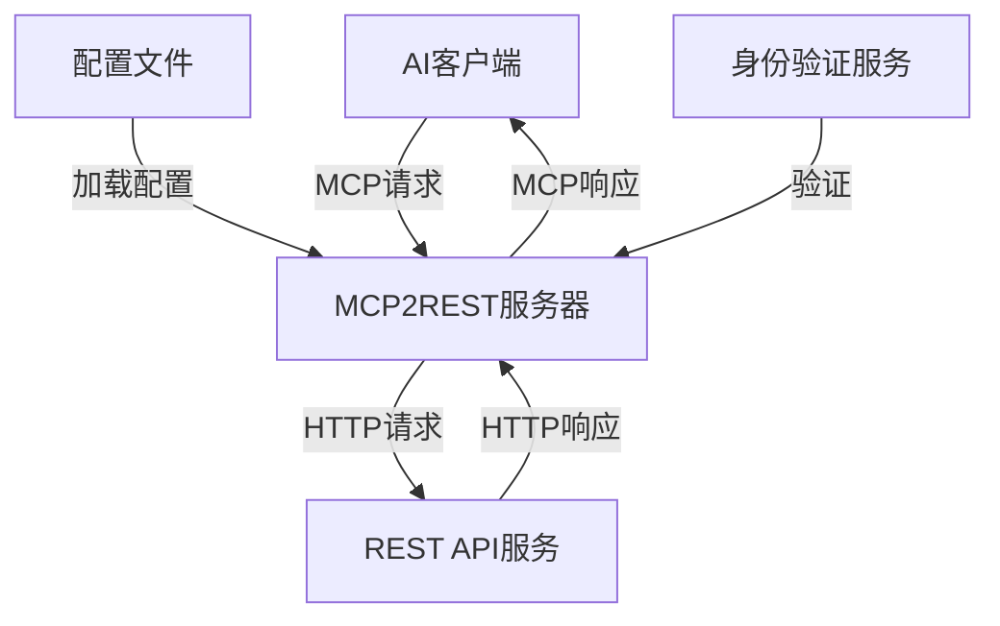
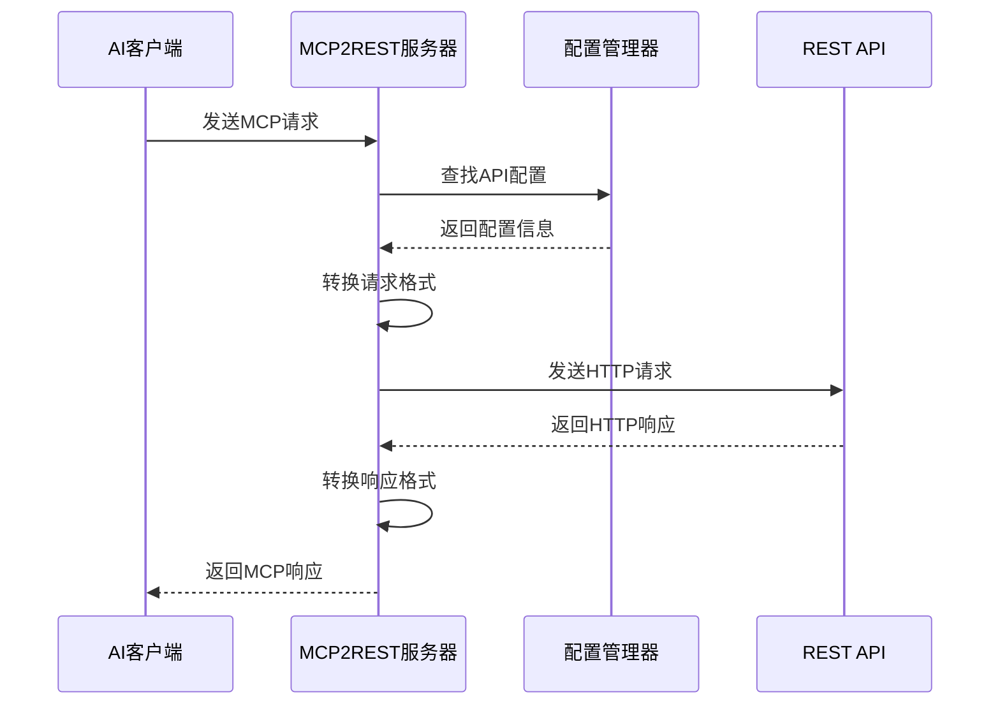

# MCP2REST 通用网关服务器设计方案

## 1. 需求分析

### 1.1 背景
- 当前MCP服务器仅支持stdio或websocket通信方式
- 需要构建一个通用的基于配置的MCP服务器
- 目标是通过简单配置即可对接已有的REST API

### 1.2 核心需求
1. 支持通过配置文件定义API映射关系
2. 将MCP协议的工具调用转换为REST API调用
3. 将REST API的响应转换回MCP协议格式
4. 提供灵活的参数映射和转换机制
5. 支持身份验证和安全机制

## 2. 系统架构设计

### 2.1 整体架构



### 2.2 核心组件

1. **MCP服务器**：处理MCP协议通信，支持stdio和websocket
2. **配置管理器**：加载和解析API配置文件
3. **请求转换器**：将MCP请求转换为HTTP请求
4. **响应转换器**：将HTTP响应转换为MCP响应
5. **身份验证管理器**：处理API身份验证
6. **日志和监控**：记录请求和响应，监控系统状态

## 3. 配置文件设计

### 3.1 配置文件格式

采用YAML格式，主要包含以下部分：

```yaml
# 服务器配置
server:
  port: 8080
  host: "0.0.0.0"
  mode: "websocket"  # 或 "stdio"

# 全局设置
global:
  timeout: 30s
  max_request_size: "10MB"
  default_headers:
    User-Agent: "MCP2REST-Gateway/1.0"

# API端点配置
endpoints:
  - name: "get_weather"
    description: "获取天气信息"
    method: "GET"
    url_template: "https://api.weather.com/forecast/{location}"
    authentication:
      type: "bearer"
      token_env: "WEATHER_API_TOKEN"
    parameters:
      - name: "location"
        required: true
        description: "城市名称或坐标"
        in: "path"
      - name: "units"
        required: false
        default: "metric"
        in: "query"
    response:
      success_code: 200
      error_codes:
        404: "位置未找到"
        401: "未授权访问"
      transform:
        type: "jq"
        expression: ".data.forecast | {temperature: .temp, condition: .weather, humidity: .humidity}"

  - name: "create_user"
    description: "创建新用户"
    method: "POST"
    url_template: "https://api.example.com/users"
    authentication:
      type: "api_key"
      header_name: "X-API-Key"
      key_env: "USER_API_KEY"
    parameters:
      - name: "username"
        required: true
        in: "body"
      - name: "email"
        required: true
        in: "body"
      - name: "password"
        required: true
        in: "body"
        sensitive: true
    response:
      success_code: 201
      error_codes:
        400: "无效的用户数据"
        409: "用户名已存在"
```

### 3.2 配置项说明

1. **服务器配置**：
   - `port`：服务器监听端口
   - `host`：服务器监听地址
   - `mode`：通信模式（websocket或stdio）

2. **全局设置**：
   - `timeout`：请求超时时间
   - `max_request_size`：最大请求大小
   - `default_headers`：默认HTTP头

3. **API端点配置**：
   - `name`：端点名称，对应MCP工具名
   - `description`：端点描述
   - `method`：HTTP方法（GET, POST, PUT, DELETE等）
   - `url_template`：URL模板，支持参数替换
   - `authentication`：身份验证配置
   - `parameters`：参数配置
   - `response`：响应处理配置

4. **参数配置**：
   - `name`：参数名称
   - `required`：是否必需
   - `default`：默认值
   - `in`：参数位置（path, query, body, header）
   - `sensitive`：是否敏感数据（不记录日志）

5. **响应处理配置**：
   - `success_code`：成功状态码
   - `error_codes`：错误状态码映射
   - `transform`：响应转换配置

## 4. 工作流程

### 4.1 请求处理流程



### 4.2 详细流程

1. **接收MCP请求**：
   - 解析MCP JSON-RPC请求
   - 提取工具名称和参数

2. **查找API配置**：
   - 根据工具名称查找对应的API配置
   - 验证配置有效性

3. **参数处理**：
   - 验证必需参数是否提供
   - 应用默认值
   - 根据参数位置进行分类（路径参数、查询参数、请求体参数、头参数）

4. **构建HTTP请求**：
   - 替换URL模板中的路径参数
   - 添加查询参数
   - 构建请求体
   - 添加身份验证头
   - 添加其他头信息

5. **发送HTTP请求**：
   - 设置超时
   - 发送请求
   - 处理网络错误

6. **处理HTTP响应**：
   - 检查状态码
   - 解析响应体
   - 应用响应转换

7. **构建MCP响应**：
   - 格式化响应数据
   - 处理错误情况
   - 构建MCP JSON-RPC响应

8. **返回MCP响应**：
   - 通过stdio或websocket返回响应

## 5. 关键功能设计

### 5.1 参数映射与转换

支持以下参数映射方式：

1. **直接映射**：MCP参数直接映射到REST参数
2. **路径参数**：替换URL模板中的占位符
3. **查询参数**：添加到URL查询字符串
4. **请求体参数**：添加到请求体（支持JSON、表单等格式）
5. **头参数**：添加到请求头

### 5.2 身份验证支持

支持以下身份验证方式：

1. **Bearer Token**：通过Authorization头传递令牌
2. **API Key**：通过自定义头或查询参数传递API密钥
3. **Basic Auth**：通过Authorization头传递用户名和密码
4. **OAuth2**：支持客户端凭证流程

### 5.3 响应转换

支持以下响应转换方式：

1. **直接返回**：直接返回原始响应
2. **JQ转换**：使用JQ表达式转换响应
3. **模板转换**：使用模板引擎转换响应
4. **自定义函数**：使用自定义函数转换响应

### 5.4 错误处理

1. **HTTP错误**：处理HTTP错误状态码
2. **网络错误**：处理网络连接错误
3. **超时错误**：处理请求超时
4. **参数错误**：处理参数验证错误
5. **配置错误**：处理配置解析错误

## 6. 安全性设计

### 6.1 身份验证安全

1. **敏感信息保护**：通过环境变量或安全存储获取令牌和密钥
2. **令牌轮换**：支持定期轮换令牌
3. **最小权限原则**：为每个API端点配置最小所需权限

### 6.2 请求安全

1. **输入验证**：验证所有输入参数
2. **请求限制**：限制请求大小和频率
3. **CORS配置**：配置跨域资源共享策略

### 6.3 响应安全

1. **敏感数据过滤**：过滤响应中的敏感数据
2. **错误信息保护**：避免泄露敏感的错误信息

## 7. 扩展性设计

### 7.1 插件系统

设计插件系统支持以下扩展点：

1. **请求转换器**：自定义请求转换逻辑
2. **响应转换器**：自定义响应转换逻辑
3. **身份验证提供者**：自定义身份验证逻辑
4. **日志记录器**：自定义日志记录逻辑

### 7.2 配置热重载

支持在不重启服务的情况下重新加载配置文件，实现动态更新API配置。

## 8. 部署与运维

### 8.1 部署选项

1. **独立服务**：作为独立的HTTP服务运行
2. **嵌入式**：嵌入到其他应用中
3. **容器化**：提供Docker镜像和Kubernetes配置

### 8.2 监控与日志

1. **请求日志**：记录所有请求和响应（过滤敏感信息）
2. **性能指标**：记录请求延迟、错误率等指标
3. **健康检查**：提供健康检查端点
4. **告警**：配置关键指标的告警阈值

## 9. 实现路线图

### 9.1 第一阶段：核心功能

1. 实现基本的MCP服务器（支持stdio和websocket）
2. 实现配置文件解析
3. 实现基本的请求和响应转换
4. 实现简单的身份验证支持

### 9.2 第二阶段：增强功能

1. 实现高级参数映射和转换
2. 实现高级响应转换
3. 实现完整的身份验证支持
4. 实现错误处理和重试机制

### 9.3 第三阶段：扩展功能

1. 实现插件系统
2. 实现配置热重载
3. 实现高级监控和日志
4. 实现性能优化

## 10. 示例场景

### 10.1 天气API集成

```yaml
endpoints:
  - name: "get_weather"
    description: "获取指定城市的天气预报"
    method: "GET"
    url_template: "https://api.weather.com/v1/forecast/{city}"
    authentication:
      type: "api_key"
      header_name: "X-API-Key"
      key_env: "WEATHER_API_KEY"
    parameters:
      - name: "city"
        required: true
        description: "城市名称"
        in: "path"
      - name: "days"
        required: false
        default: "3"
        description: "预报天数"
        in: "query"
    response:
      success_code: 200
      transform:
        type: "jq"
        expression: ".forecast | {current: .current, daily: .daily[:3]}"
```

### 10.2 用户管理API集成

```yaml
endpoints:
  - name: "create_user"
    description: "创建新用户"
    method: "POST"
    url_template: "https://api.example.com/users"
    authentication:
      type: "bearer"
      token_env: "USER_API_TOKEN"
    parameters:
      - name: "username"
        required: true
        in: "body"
      - name: "email"
        required: true
        in: "body"
      - name: "password"
        required: true
        in: "body"
        sensitive: true
    response:
      success_code: 201
      transform:
        type: "template"
        template: "用户 {{.username}} 创建成功，ID: {{.id}}"
```

## 11. 总结

本设计方案提供了一个灵活、可扩展的MCP2REST通用网关服务器，通过简单的配置即可将MCP协议请求转换为REST API请求，实现AI助手与现有Web服务的无缝集成。该方案具有以下优势：

1. **配置驱动**：通过YAML配置文件定义API映射，无需编写代码
2. **灵活映射**：支持多种参数映射和响应转换方式
3. **安全可靠**：内置身份验证和安全机制
4. **可扩展**：插件系统支持自定义逻辑
5. **易于部署**：支持多种部署选项

通过实现这一方案，可以大大简化AI助手与REST API的集成过程，提高开发效率和系统可维护性。